# Optimal NAMASTE-WHO TM2 Dual Coding Architecture

## 🎯 **Problem Statement Analysis**

Your problem statement requires creating a **dual coding system** that:
1. ✅ **NAMASTE CodeSystem** from Excel files
2. ✅ **WHO ICD-11 TM2 CodeSystem** from API integration  
3. ✅ **ConceptMap** for NAMASTE ↔ WHO TM2 translation
4. ✅ **FHIR-compliant** operations for clinical use
5. ✅ **Auto-complete** and translation endpoints
6. ✅ **Dual coding** in Problem Lists

## 🏗️ **Corrected Architecture (Optimal Approach)**

### **Why Your Current Understanding Needs Adjustment:**

❌ **Problem with Current Approach:**
- WHO API is **search-based**, not bulk export
- Cannot get "all TM2 entities" without specific terms
- Current implementation finds 0 TM2 entities because search terms are too generic

✅ **Optimal Solution:**
- Use **NAMASTE terms as WHO search queries**
- Create **systematic mapping** between both systems
- Generate **proper ConceptMap** for translation operations

### **Phase 1: Data Acquisition & Mapping**


### **Phase 2: FHIR Operations**

```mermaid
graph TD
    A[ConceptMap] --> B[NAMASTE→WHO Translation]
    A --> C[WHO→NAMASTE Translation]
    B --> D[Auto-complete ValueSets]
    C --> D
    D --> E[Clinical Interface]
    E --> F[FHIR Bundle Upload]
    F --> G[Problem List with Dual Codes]
```



## 🔧 **Implementation Strategy**

### **Step 1: Comprehensive Mapping Service**
Created `NAMASTEWHOMappingService` that:
1. **Extracts** all NAMASTE terms from existing CodeSystems
2. **Searches** WHO API using each NAMASTE term as query
3. **Maps** NAMASTE terms to WHO TM2 entities with confidence scoring
4. **Creates** enhanced WHO TM2 CodeSystem with mapped entities
5. **Generates** FHIR ConceptMap for translation operations

### **Step 2: Mapping API Endpoints**
```bash
POST /api/v1/mapping/create-comprehensive  # Start comprehensive mapping
GET  /api/v1/mapping/status                # Check mapping progress
POST /api/v1/mapping/translate             # NAMASTE ↔ WHO translation
GET  /api/v1/mapping/conceptmap            # Get FHIR ConceptMap
```

### **Step 3: Example Workflow**

```bash
# 1. Create comprehensive mapping
curl -X POST "http://localhost:8000/api/v1/mapping/create-comprehensive"

# 2. Check mapping status
curl "http://localhost:8000/api/v1/mapping/status"

# 3. Translate NAMASTE code to WHO TM2
curl -X POST "http://localhost:8000/api/v1/mapping/translate?source_system=namaste&source_code=AY001&target_system=who-tm2"

# 4. Get ConceptMap for clinical systems
curl "http://localhost:8000/api/v1/mapping/conceptmap"
```

## 📊 **Expected Results**

### **NAMASTE Terms → WHO TM2 Mapping Examples:**
```json
{
  "namaste_term": {
    "code": "AY001",
    "display": "Vata Dosha Imbalance",
    "system_type": "AYURVEDA"
  },
  "who_entities": [
    {
      "code": "XK7G",
      "display": "Traditional medicine condition pattern",
      "definition": "Pattern-based diagnosis in traditional medicine"
    }
  ],
  "mapping_confidence": 0.85
}
```

### **Generated ConceptMap Structure:**
```json
{
  "resourceType": "ConceptMap",
  "id": "namaste-who-tm2-mapping",
  "sourceUri": "http://namaste.ayush.gov.in/fhir/CodeSystem/namaste",
  "targetUri": "http://who.int/icd11/tm2",
  "group": [
    {
      "source": "http://namaste.ayush.gov.in/fhir/CodeSystem/ayurveda",
      "target": "http://who.int/icd11/tm2",
      "element": [
        {
          "code": "AY001",
          "display": "Vata Dosha Imbalance",
          "target": [
            {
              "code": "XK7G",
              "display": "Traditional medicine condition pattern",
              "equivalence": "wider",
              "comment": "Mapping confidence: 0.85"
            }
          ]
        }
      ]
    }
  ]
}
```

## 🎯 **Benefits of This Approach**

### **1. Addresses Problem Statement Requirements:**
✅ **FHIR-compliant** CodeSystems and ConceptMaps  
✅ **Translation operations** for dual coding  
✅ **Auto-complete** support with mapped terms  
✅ **Clinical workflow** integration ready  

### **2. Optimal WHO API Usage:**
✅ **Systematic search** using NAMASTE terms  
✅ **Confidence scoring** for mapping quality  
✅ **Rate limiting** compliance  
✅ **Targeted results** instead of generic searches  

### **3. Clinical Benefits:**
✅ **Dual coding** in EMR Problem Lists  
✅ **Insurance claims** with global ICD-11 codes  
✅ **Interoperability** with international systems  
✅ **Analytics** for Ministry of Ayush  

## 🚀 **Next Steps**

### **Immediate Actions:**
1. **Start the server**: `uvicorn app.main:app --port 8000 --reload`
2. **Run comprehensive mapping**: `POST /api/v1/mapping/create-comprehensive`
3. **Test translation operations**: Use mapping endpoints
4. **Validate FHIR compliance**: Check generated ConceptMap

### **Integration with Clinical Systems:**
1. **Auto-complete widgets** using ValueSets from ConceptMap
2. **Problem List entries** with both NAMASTE and WHO codes
3. **FHIR Bundle upload** with dual coding support
4. **Analytics dashboard** for mapping statistics

## 📋 **Summary**

**Your corrected understanding is exactly right!** 

The optimal approach is:
1. ✅ **NAMASTE CodeSystem** from Excel processing
2. ✅ **Use NAMASTE terms to search WHO API** (not bulk export)
3. ✅ **Create WHO TM2 CodeSystem** from mapped entities
4. ✅ **Generate ConceptMap** for systematic translation
5. ✅ **Implement FHIR operations** for clinical use

This approach maximizes the utility of both coding systems while ensuring FHIR compliance and clinical workflow integration as required by the problem statement.